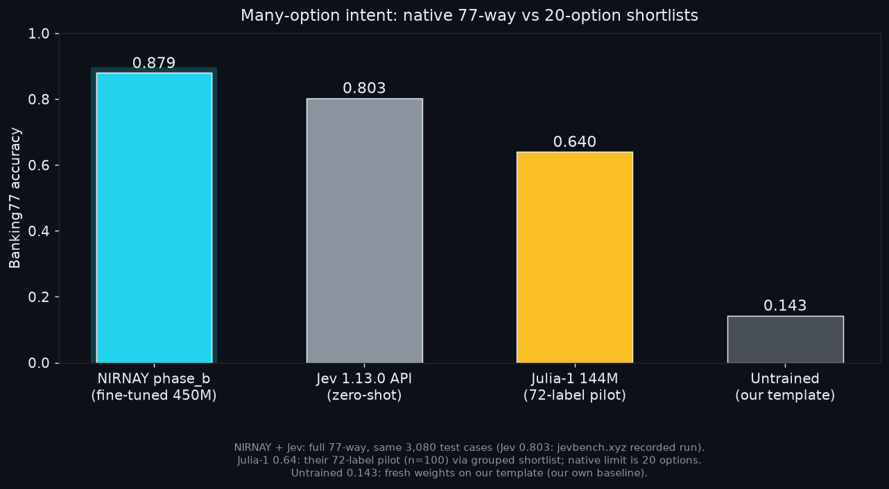
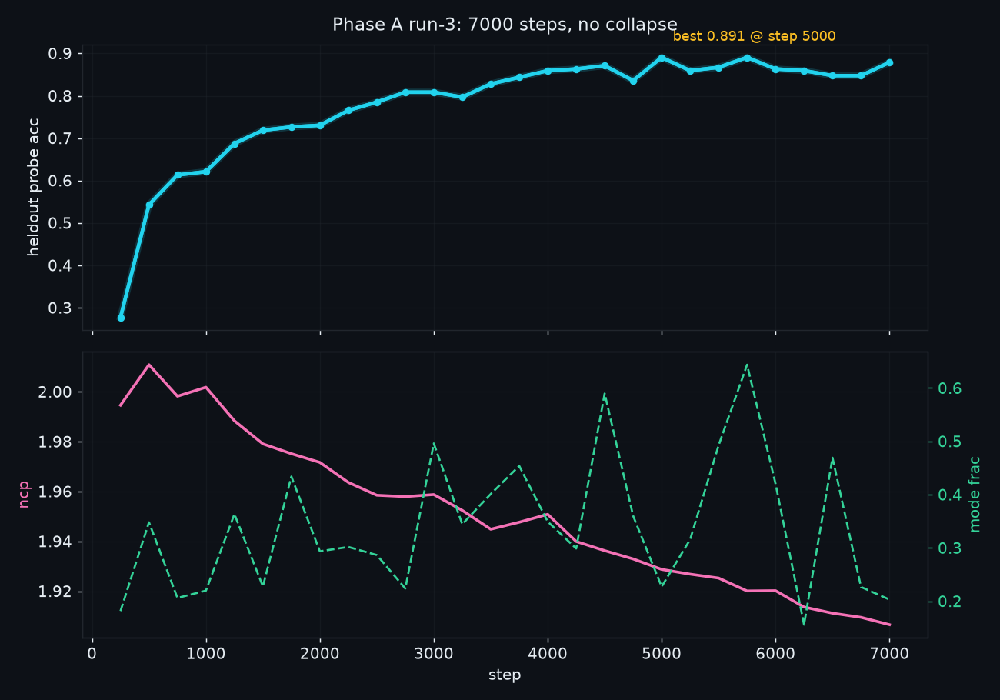
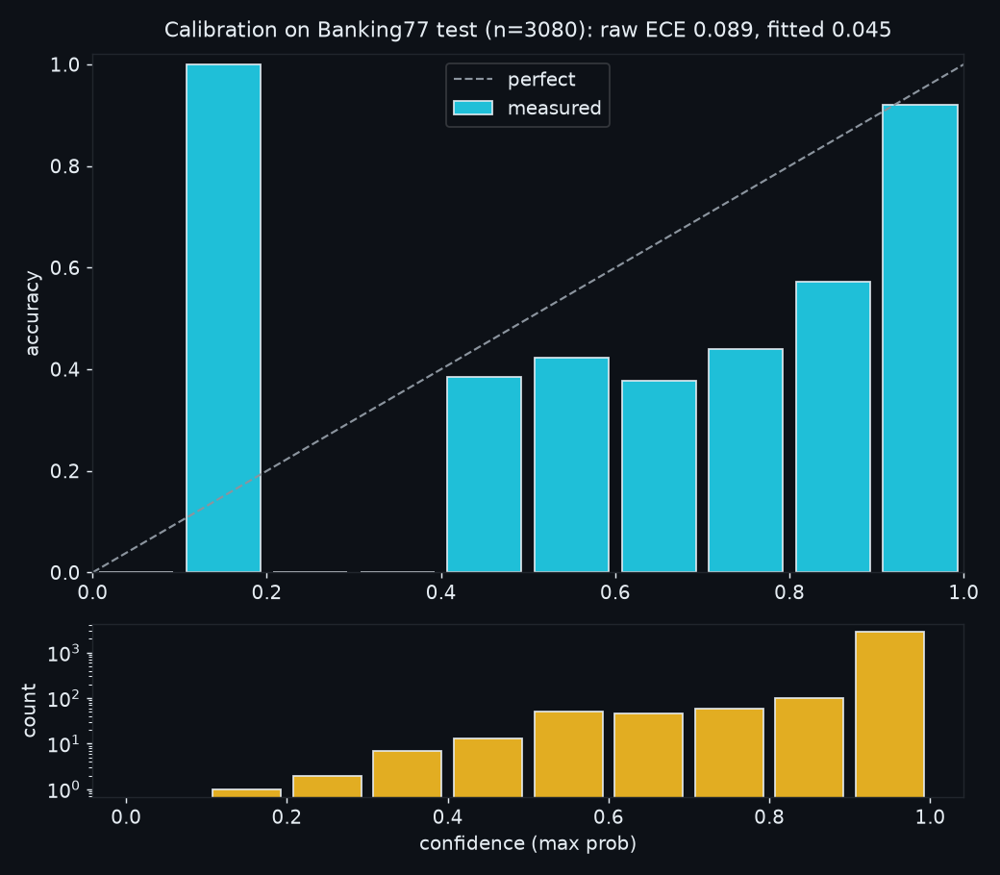

# NIRNAY 450M: a small calibrated decision model that beats Jev on Banking77

[](./NIRNAY-Breakthrough-Plan.md)
[](./src/nirnay/train.py)
[](./eval/banking77_phase_b.json)
[](./eval/banking77_phase_b.json)
[](./GATES.md)
[](https://eulogik.com)

**NIRNAY (निर्णय, "decision") is a 450M open-weight classifier for banking intent and typed decisions.** One forward pass turns a state plus a question into calibrated probabilities. No text generation, no API key, no per-call bill. Apache-2.0, built by [Eulogik](https://eulogik.com).



Banking77 keywords for search: banking intent classification, 77-way intent classifier, intent detection model, small language model for classification, calibrated decision model, system one model, Jev alternative, Laya fine-tune, on-device text classifier, Apache 2.0 classifier.

## Numbers first

| Model | Banking77 test (n=3080) | Setup |
|---|---|---|
| **NIRNAY phase_b** | **0.8792** (Brier 0.208, ECE raw 0.089 / fitted 0.045) | fine-tuned, this repo |
| NIRNAY phase_a | 0.8656 (Brier 0.240, ECE raw 0.110 / fitted 0.033) | fine-tuned, this repo |
| Jev 1.13.0 | 0.803 (same 3,080 cases, recorded run) | zero-shot API ([jevbench.xyz](https://jevbench.xyz)) |
| Julia-1 144M | 0.64 (their 72-label pilot, n=100, shortlist) | their card concedes grouped routing drops answers |
| Untrained baseline | 0.143 (our template, our measurement) | fresh weights |

Raw JSON: [`eval/banking77_phase_b.json`](./eval/banking77_phase_b.json), [`eval/banking77_phase_a.json`](./eval/banking77_phase_a.json). Same test split for every row above. The honest caveat: we fine-tuned on the train split, Jev answered zero-shot. That is exactly the Laya thesis (a model you fine-tune on your data), and this repo proves it works: +7.6 points over the API on identical cases.

Speed, batch-1, measured 2026-09-30: **209 ms on M4 MPS, 361 ms on CPU.** Faster than Jev API calls (310 to 478 ms in independent runs). Slower than Laya's 33 ms. Corpus latency work (ONNX) is open.

## Try it

```bash
pip install git+https://github.com/eulogik/nirnay
```

```python
from nirnay.agent import NirnayAgent

agent = NirnayAgent(device="mps", checkpoint_path="phase_b.pt", enable_byte_path=False)
out = agent.act(
    state="My card was charged twice for the same order.",
    questions={"intent": {
        "type": "choice",
        "instructions": "Classify the banking intent.",
        "criteria": {"duplicate_charge": "charged twice", "refund_status": "ask about refund"},
    }},
)
print(out["answers"]["intent"]["probabilities"])
```

The checkpoint loads with `NirnayAgent(checkpoint_path=...)`. Full eval harness: `scripts/eval_checkpoint.py`. Server: `nirnay.server` exposes `POST /v1/systemone` (Jev-compatible wire format).

## How it was trained

Base is Laya 421M (Apache-2.0) plus ~30M of additions (concept bottleneck, deep supervision, coarse-to-fine pointer, byte path). 7,000 Phase A steps + 50 RLCD steps, all on one Mac. Three-group optimizer, seeded everything, hashes frozen before training.



Two training deaths taught us the fixes (both landed, both gated):

1. **Scale runaway.** The concept encoder output grew unboundedly (healthy RMS 0.09, dead 13.5) while centroids sat still, so the VQ loss exploded 300x. Fix: affine-free LayerNorm on `z` before quantize. Scale stops being a degree of freedom. Zero new params.
2. **Usage collapse.** With no pressure on code usage, all tokens fell into one code per chunk, the quantized states went constant, and accuracy flatlined at 1/77 with no loss spike to warn you. Fix: a load-balancing aux term (hard fractions times soft probs, linear so gradients never vanish).

Plus a safety net around training itself: heldout probes every 250 steps, best-checkpoint retention, and an abort that fires when accuracy halves. It caught four real collapses during development. Details: [`NIRNAY-Breakthrough-Plan.md`](./NIRNAY-Breakthrough-Plan.md) (amendment 2026-09-26), [`MEMORY.md`](./MEMORY.md).

## Calibration

We report raw and fitted ECE on every eval, always. Phase_b on Banking77 test:



Most mass sits above 0.9 confidence at 92% accuracy there. Per-bucket temperatures ship with the run.

## Architecture


Bytes and token ids feed a frozen Laya encoder (LoRA adapters train). A concept bottleneck (layer-normed product-VQ, 4 chunks x 32 codes, mixture-of-slots) adds a learned residual. A 2-layer head scores dense markers; a coarse-to-fine pointer re-ranks the top 20 for 77-way decisions. Per-bucket temperatures calibrate the output. Deep supervision at layers 4/8/12 and RLCD exist only at training time.

## Evals and honesty

* `eval/` holds the raw result JSONs. Reproduce with `scripts/eval_checkpoint.py --checkpoint <ckpt>`.
* JevBench public (231 items, shipped checkpoint): **0.550** overall, easy 0.875, original 0.569, hard 0.396. The hard tier (long policy docs, probability, temporal reasoning) is the gap. We publish it because the plan pre-registers pass/fail either way. Training data for that gap (10k programmatic reasoning items, ground truth by construction) is in `src/nirnay/data_synth_hard.py`.
* 19/19 gate checks green ([`GATES.md`](./GATES.md)). Zero-shot and fine-tuned numbers are never mixed.

## Limits

* 512-token context. Long documents get head-truncated; the hard JevBench tier shows it (0.396). Longer context is v1.1 work.
* CPU latency 361 ms per decision in PyTorch. No ONNX export yet, no GGUF/Ollama build yet.
* Banking77 is the proven lane (triage, routing, guardrails). Anything else, measure before trusting.

## FAQ

**What is NIRNAY?** A 450M Apache-2.0 decision model: state plus typed question in, calibrated probabilities out. Choice, score, and yes/no questions.

**How accurate is it?** 87.9% on Banking77 test (3,080 cases), Brier 0.208, fitted ECE 0.045.

**How does it compare to Jev?** On identical Banking77 test cases: 0.879 (fine-tuned) vs 0.803 (Jev 1.13.0 zero-shot API). Ours runs local, no per-call cost.

**How does it compare to Laya?** Laya is our base (421M, Apache-2.0). We fixed its training instability, added the concept bottleneck and pointer, and fine-tuned it. Untrained on our template it scores 0.143 here.

**How fast is it?** 209 ms per decision on M4 GPU, 361 ms on CPU, batch-1, measured.

**What license?** Apache-2.0. Commercial use fine.

**What hardware trained it?** One Mac (M4, 16GB). Full run about 4 hours. Cloud spend: $0. Receipts in `logs/` and `MEMORY.md`.

**What is it bad at?** Long documents over 512 tokens, and JevBench-hard style probability/temporal reasoning (0.396). See Limits.

## Built by Eulogik

NIRNAY is built by [Eulogik](https://eulogik.com) ([GitHub](https://github.com/eulogik), contact: info@eulogik.com), makers of pico-type, NanoForecast, TinyDoc-VLM, and KARN. Same house rules: Apache-2.0, measured numbers only, runs on your hardware.

## License

Apache-2.0. Laya base (ConvAI Innovations, Apache-2.0). Banking77 data (PolyAI, CC-BY-4.0).
